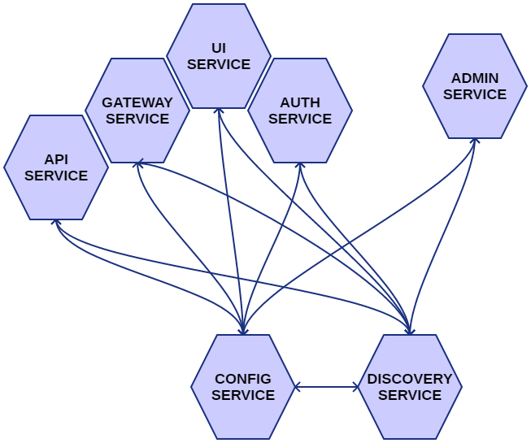

# SPRING BOOT ANGULAR 2 STARTER

[](https://travis-ci.org/shardis/spring-angular2-starter)

## PROJECT DESCRIPTION:

This sample project demonstrates how to integrate Spring Boot application with Angular 2.
It could be used as base for your future Angular2 Java projects.
Node and npm are installed as part of maven build. Also webpack build and karma tests runs with maven.
It also uses Spring Cloud microservices and Spring Security with Oauth2 JWT tokens.

### [LIVE DEMO: http://shardis.com/](http://shardis.com/)
### [EUREKA: http://shardis.com:8081/](http://shardis.com:8081/)

## FEATURES:
* Build and testing process integrated with maven
* Spring cloud microservices with service discovery
* Spring security Oauth2 integration
* Docker integration (optional)
* Angular Cli integration
* Scss support
* Angular material integration
* Font-awesome integration
* Lazy loaded routes
* Spring Boot admin support
* Spring REST Docs support

## MICROSERVICES:



## USAGE WITH DOCKER (RECOMMENDED)

### DOCKER BUILD (PRODUCTION MODE):

Build the docker image for all services with default maven profile

```
mvn install
```

### DOCKER BUILD (DEVELOPMENT MODE):

Build the docker image for all services with dev maven profile
To use development mode you need also webpack development server running in background

```
mvn install -P dev
```

### RUNNING CONTAINERS:

After building applications run all containers with docker-compose

```
docker-compose up
```

## STANDALONE USAGE WITHOUT DOCKER (NO LONGER RECOMMENDED)

### RUNNING IN PRODUCTION MODE:

If you want to work without docker you need to use prod-standalone maven profile

Compile and package project:
```
mvn clean package -P prod-standalone
```

Then run config server:
```
cd shardis-config/
java -jar ./target/shardis-config-2.3.0.jar
```

Then run discovery server:
```
cd shardis-discovery/
java -jar ./target/shardis-discovery-2.3.0.jar
```

Then run gateway server:
```
cd shardis-gateway/
java -jar ./target/shardis-gateway-2.3.0.jar
```

Then run api server:
```
cd shardis-api/
java -jar ./target/shardis-api-2.3.0.jar
```

Then run auth server:
```
cd shardis-auth/
java -jar ./target/shardis-auth-2.3.0.jar
```

Then run ui server:
```
cd shardis-ui/
java -jar ./target/shardis-ui-2.3.0.jar
```


Then run admin server (optional):
```
cd shardis-admin/
java -jar ./target/shardis-admin-2.3.0.jar
```


### RUNNING IN DEVELOPMENT MODE:

If you want to work without docker you need to use dev-standalone maven profile
To use development mode you need also webpack development server running in background

Install all dependencies at first:
```
mvn clean install -P dev-standalone
```

Run config server in development mode:
```
cd shardis-config
mvn spring-boot:run -P dev-standalone
```

Run discovery server in development mode:
```
cd shardis-discovery
mvn spring-boot:run -P dev-standalone
```

Run gateway server in development mode:
```
cd shardis-gateway
mvn spring-boot:run -P dev-standalone
```

Run api server in development mode:
```
cd shardis-api
mvn spring-boot:run -P dev-standalone
```

Run auth server in development mode:
```
cd shardis-auth
mvn spring-boot:run -P dev-standalone
```

Run ui server in development mode:
```
cd shardis-ui
mvn spring-boot:run -P dev-standalone
```

Run admin server (optional) in development mode:
```
cd shardis-admin
mvn spring-boot:run -P dev-standalone
```

## RUNNING DEV SERVER FOR DEVELOPMENT MODE:

Run development server:
```
cd shardis-ui
npm run server
```

Visit your app at http://localhost:4200/

Proxies for api calls can be configured in proxy.json file.
Default configuration assumes that your api is running at localhost:8080

## TESTING ANGULAR FRONTEND

Running unit tests:
```
cd shardis-ui
npm run test
```

Running e2e tests:
```
cd shardis-ui
npm run e2e
```


## CHANGELOG:

### 2.3.0 (unreleased)
* Dependency updates
* Updated Codelyzer to 1.0.0-beta.1 and re-enabled rules broken by Angular 2.0.2
* Fixed scrollToTop method in crud form

### 2.2.0 (09.10.2016)
* Introduced Angular-Cli as angular build tool
* Updated Angular to 2.0.2
* Updated Angular Material to 2.0.0-alpha.9-3
* Updated Node to v6.7.0
* Updated Spring Platform to Athens-RELEASE
* Updated Spring Boot to 1.4.1.RELEASE
* Updated Spring Cloud to Camden.RELEASE
* Updated Spring Boot Admin to 1.4.2
* Updated Docker Maven Plugin to 0.4.13
* Added docker cleanup script for Windows
* Added tags for generated docker images
* Added separate routing modules to all lazy loaded Angular modules
* Extracted common modules and providers to one place
* Updated Angular-Cli to 1.0.0-beta.17
* Rewritten all Angular tests


### 2.1.0 (28.08.2016)
* Added Spring Cloud Config server for centralized configuration
* Added Spring REST Docs support for API microservices
* Remapped coverage reports to typescript
* Rewritten angular tests using Testbed
* Updated Spring Cloud to Brixton.SR5
* Updated angular2-material to 2.0.0-alpha.7-4
* Updated dependencies
* Removed typedoc (it doesn't support typescript2)

### 2.0.0 (16.08.2016)
* Updated Spring Platform to Athens-RC1 and Spring Boot to 1.4.0
* Updated Spring Cloud to Brixton.SR4
* Updated Node to v6.3.1 and npm to 3.10.3
* Updated dependencies
* Removed shardis-parent project
* Added docker support (thanks to Tarun Sukhu)
* Disabled Eureka client in unit tests
* Docker and standalone profiles
* Spring Boot admin support
* Added gateway service
* Updated Angular to rc.5
* Updated angular2-material to 2.0.0-alpha.7-2
* Added live demo


[show full changelog](docs/CHANGELOG.md)
